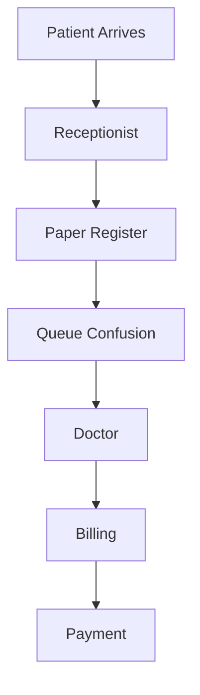
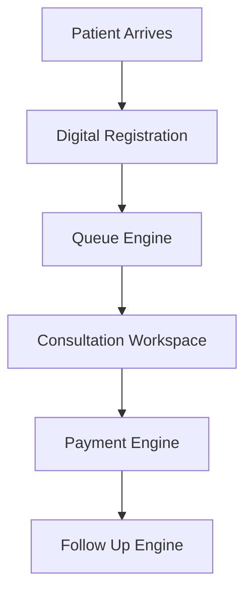

# CLINICOS FRONTIER MARKET INTELLIGENCE OPERATING SYSTEM
# JABALPUR LAUNCH DECISION ENGINE
## Version 6.0
### Classification: Founder-Grade | Investor-Grade | Product-Grade | GTM-Grade | Intelligence-Grade

---

# EXECUTIVE SUMMARY

## Core Question

Should ClinicOS launch in Jabalpur?

## Executive Answer

YES.

But not in the way most SaaS founders launch.

Do not launch:

- City-wide
- Multi-segment
- Feature-heavy
- Generic healthcare SaaS

Launch:

- Cluster-first
- ICP-first
- Workflow-first
- Pain-first
- Founder-led

The data suggests that Jabalpur is not merely a viable market.

Jabalpur is potentially an ideal beachhead market for ClinicOS because:

1. Healthcare supply is fragmented.
2. Clinic concentration is high.
3. Digital maturity is low-to-medium.
4. Existing workflow sophistication is weak.
5. Operational inefficiencies are extremely high.
6. Competition is present but not deeply entrenched.
7. Customer acquisition can be executed physically.
8. Product-market feedback loops can be extremely fast.

The opportunity is not software.

The opportunity is operational transformation.

ClinicOS wins when:

- Queue chaos disappears
- Receptionist workload drops
- Payment leakage reduces
- Follow-up execution improves
- Doctors save time

Not when AI writes prescriptions.

---

# EXECUTIVE DASHBOARD

| Category | Status |
|-----------|----------|
| Market Viability | HIGH |
| Product-Market Fit Probability | HIGH |
| Competitive Threat | MEDIUM |
| Digital Maturity | LOW-MEDIUM |
| Adoption Difficulty | MEDIUM |
| Expansion Potential | HIGH |
| Revenue Concentration | HIGH |
| Founder-Led Sales Feasibility | VERY HIGH |
| Operational Pain Severity | VERY HIGH |
| Recommended Launch | YES |

---

# HEALTHCARE ECOSYSTEM INTELLIGENCE

---

## Ecosystem Structure

Based on entity distribution.

The healthcare market is dominated by:

### Tier 1 Segments

1. Clinics
2. ENT Clinics
3. Dental Clinics
4. Hospitals
5. Diagnostic Labs

### Tier 2 Segments

1. Orthopedic Clinics
2. Gynecology Clinics
3. Pediatric Clinics
4. Cardiology Clinics

### Tier 3 Segments

1. Specialty Centers
2. Physiotherapy Centers
3. Nursing Homes

---

## Ecosystem Analysis

### Clinics

Market Share:
Largest

Fragmentation:
Extremely High

Digital Maturity:
Low

Operational Complexity:
Medium

Software Penetration:
Low

Opportunity:
Massive

---

### Hospitals

Market Share:
Moderate

Fragmentation:
Low

Buying Process:
Complex

Decision Makers:
Multiple

Sales Cycle:
Long

Opportunity:
Medium

---

### Diagnostic Centers

Operational Complexity:
Medium

Workflow Dependency:
High

Automation Need:
High

Opportunity:
High

But not ideal beachhead.

---

# ECOSYSTEM ATTRACTIVENESS RANKING

| Rank | Segment | Score |
|--------|---------|---------|
| 1 | Single Doctor Clinics | 96 |
| 2 | ENT Clinics | 94 |
| 3 | Dental Clinics | 93 |
| 4 | Multi Doctor Clinics | 91 |
| 5 | Pediatric Clinics | 88 |
| 6 | Orthopedic Clinics | 86 |
| 7 | Diagnostic Centers | 84 |
| 8 | Hospitals | 76 |

---

# GEOGRAPHIC INTELLIGENCE

---

# Healthcare Density Engine

## Tier 1 Localities

### Wright Town

Healthcare Density:
10/10

Commercial Density:
10/10

Digital Maturity:
8/10

Revenue Potential:
10/10

GTM Efficiency:
10/10

Adoption Probability:
9/10

Priority:
#1

Reason:

Highest healthcare concentration.

Best walk-in sales efficiency.

Most referral potential.

Most network effects.

---

### Napier Town

Density:
9.5/10

Revenue:
9.5/10

Priority:
#2

---

### Vijay Nagar

Density:
9/10

Revenue:
9/10

Priority:
#3

---

### Home Science College Road

Density:
8.8/10

Revenue:
8.5/10

Priority:
#4

---

### Main Road Cluster

Density:
8.3/10

Priority:
#5

---

# Tier 2 Localities

- Gorakhpur
- Sadar
- Madan Mahal
- Adhartal

Good expansion markets.

Not launch markets.

---

# Tier 3 Localities

Peripheral zones.

Avoid for first 12 months.

---

# LOCALITY PRIORITY HEATMAP

| Locality | Density | Revenue | Adoption | GTM |
|-----------|----------|----------|-----------|------|
| Wright Town | 10 | 10 | 9 | 10 |
| Napier Town | 9.5 | 9.5 | 9 | 9 |
| Vijay Nagar | 9 | 9 | 8.5 | 9 |
| Home Science Road | 8.8 | 8.5 | 8 | 8.5 |
| Main Road | 8.3 | 8.3 | 8 | 8 |

---

# MARKET STRUCTURE INTELLIGENCE

---

## Market Type

Highly Fragmented

Not Consolidated

This is extremely important.

Fragmented markets are ideal for SaaS.

Why?

Because:

No dominant software vendor.

No dominant workflow standard.

No dominant operating system.

Meaning:

ClinicOS can become the operating layer.

---

# Market Characteristics

## Operational Maturity

LOW

## Process Maturity

LOW

## Software Penetration

LOW

## Automation Adoption

LOW

## WhatsApp Dependency

VERY HIGH

## Paper Dependency

VERY HIGH

---

# MARKET OPPORTUNITY SCORE

| Factor | Score |
|----------|---------|
| Fragmentation | 10 |
| Digital Maturity Gap | 9 |
| Workflow Pain | 10 |
| Software Competition | 7 |
| Expansion Potential | 9 |
| Total | 45/50 |

---

# ICP DISCOVERY ENGINE

---

# ICP #1

## Single Doctor Clinics

Pain:
10/10

Buying Speed:
10/10

CAC:
Very Low

Retention:
High

Expansion:
Medium

LTV:
Good

Recommendation:
PRIMARY ICP

---

# ICP #2

## ENT Clinics

Pain:
9.5/10

Queue Pressure:
Very High

Follow-Up Need:
High

Retention:
High

Recommendation:
PRIMARY ICP

---

# ICP #3

## Dental Clinics

Pain:
9/10

Patient History Importance:
High

Follow-Up Need:
Very High

Recommendation:
PRIMARY ICP

---

# ICP #4

## Multi Doctor Clinics

Revenue:
Very High

Buying Complexity:
Medium

Sales Cycle:
Medium

Recommendation:
SECONDARY ICP

---

# ICP MATRIX

| ICP | Pain | CAC | LTV | Retention |
|--------|------|------|------|-----------|
| Single Doctor | 10 | 10 | 7 | 8 |
| ENT | 9.5 | 9 | 8 | 9 |
| Dental | 9 | 9 | 8 | 9 |
| Multi Doctor | 8 | 7 | 10 | 10 |

---

# OPERATIONAL PAIN INTELLIGENCE

---

# CURRENT CLINIC JOURNEY

Patient Arrives

↓

Receptionist Finds Register

↓

Searches Patient

↓

Writes Details

↓

Calls Doctor

↓

Creates Queue

↓

Doctor Consults

↓

Writes Prescription

↓

Patient Pays

↓

Follow-Up Forgotten

---

# PAIN INDEX

| Stage | Pain |
|---------|---------|
| Registration | 8 |
| Queue | 10 |
| Consultation | 7 |
| Billing | 8 |
| Payment | 9 |
| Follow-Up | 8 |

---

# HIGHEST PAIN AREA

QUEUE MANAGEMENT

This is the wedge.

Not AI.

Not Analytics.

Not Dashboards.

Queue.

---

# WORKFLOW INTELLIGENCE

---

# Current State



# ClinicOS State



---

# TECHNOLOGY ADOPTION INTELLIGENCE

Current Stack:

- Paper
- WhatsApp
- Excel
- Memory

Not software.

This is critical.

ClinicOS is not replacing software.

ClinicOS is replacing chaos.

---

# COMPETITIVE INTELLIGENCE

## Practo

Strength:

Brand

Weakness:

Not clinic operations first.

---

## MocDoc

Strength:

Operations

Weakness:

Complexity

---

## Local Software

Strength:

Cheap

Weakness:

Terrible UX

No automation

---

# COMPETITIVE POSITIONING

```text
Manual Workflow
      ↓
Local Software
      ↓
Practo
      ↓
MocDoc
      ↓
ClinicOS
```

---

# FEATURE VALIDATION

# MUST BUILD

1. Patient Registration
2. Patient Directory
3. Queue Management
4. Calendar
5. Consultation Workspace
6. Payment Processing
7. WhatsApp Gateway
8. SMS Fallback

---

# BUILD NEXT

1. Review Mode
2. AI Mode
3. Analytics
4. Doctor BI
5. Business BI

---

# DELAY

1. Voice Agent
2. Communication Hub
3. Staff Management
4. Pharmacy Integration
5. ABDM
6. Enterprise Console

---

# REMOVE

Nothing.

---

# PRODUCT MARKET FIT MATRIX

| Feature | PMF |
|----------|---------|
| Queue | 10 |
| Registration | 9 |
| Payments | 9 |
| Consultation | 8 |
| AI | 6 |
| Voice Agent | 3 |

---

# REVENUE INTELLIGENCE

## Revenue Concentration

Expected concentration:

Single Doctor Clinics

ENT

Dental

Multi Doctor Clinics

---

# 12 MONTH MODEL

Target:

25 Clinics

Mix:

20 Starter

5 Professional

MRR:

~₹32,475

---

# 24 MONTH MODEL

Target:

100 Clinics

MRR:

₹150K–₹220K

---

# 36 MONTH MODEL

Target:

300 Clinics

MRR:

₹500K+

---

# PRICING INTELLIGENCE

Starter

₹999

Professional

₹2499

Do NOT reduce pricing.

Reason:

Problem severity supports pricing.

Cheap pricing reduces perceived value.

---

# GTM INTELLIGENCE

# FIRST 10 CLINICS

Localities:

- Wright Town
- Napier Town
- Vijay Nagar

Specialties:

- ENT
- Dental
- Single Doctor

Channel:

Founder-Led

Door-to-Door

---

# FIRST 50 CLINICS

Add:

- Referrals
- Local Champions
- Testimonials

---

# FIRST 100 CLINICS

Add:

- Dedicated onboarding
- Professional plan upsell
- Analytics

---

# 30 DAY PLAN

Week 1

- Build prospect list

Week 2

- Meet 30 clinics

Week 3

- Demo 15 clinics

Week 4

- Close first 3

---

# 60 DAY PLAN

- Deploy beta
- Collect usage
- Iterate

---

# 90 DAY PLAN

- Reach 10 paying clinics

---

# RISK REGISTER

| Risk | Severity |
|---------|----------|
| Scope Creep | Critical |
| Wrong ICP | High |
| Slow Adoption | High |
| Doctor Resistance | Medium |
| Competition | Medium |

---

# FOUNDER DECISION MEMO

What to Build?

Queue-first ClinicOS.

What to Sell?

Operational Efficiency.

What NOT to Sell?

AI.

Who Buys First?

Single doctor clinics.

Where?

Wright Town.

What Specialty?

ENT.

How?

Founder-led direct sales.

What Wins?

Queue + Payment + Registration.

What Fails?

Overbuilding.

---

# FINAL RECOMMENDATION

Build:

Operational OS

NOT

Healthcare AI Platform.

Build:

Queue Engine

Patient Engine

Payment Engine

Consultation Engine

Delay everything else.

---

# FINAL VERDICT

## ATTACK NOW

Reason:

The market opportunity exists.

The operational pain exists.

The competition is beatable.

The product scope is validated.

The GTM path is clear.

The beachhead market is available.

The only requirement is disciplined execution.
